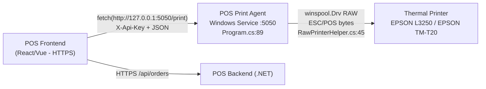
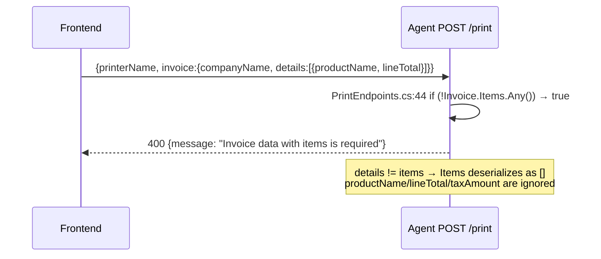
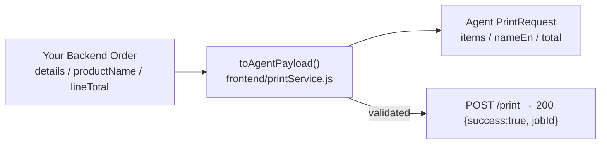

# Frontend Fix — 400 `Invoice data with items is required`

> **UPDATE 2026-09-06 — Server-side fix deployed (v1.0.1):** Agent now accepts **BOTH** shapes. `POST /print` via `POS.PrintAgent.Service/Utilities/FlexibleRequestParser.cs` handles `details`/`productName`/`lineTotal`/`companyName`/`createdAt`/`remainingAmount` **and** canonical `items`/`nameEn`/`total`/`companyNameAr`/`invoiceDate`/`changeAmount`. Your current frontend payload (Ammar) now works **without immediate change**. This doc remains the canonical contract — new code should use `items` shape.

> **TL;DR (if you want to align to contract):** You send `invoice.details[]` with `productName` / `lineTotal`. Canonical expects `invoice.items[]` (`POS.PrintAgent.Core/Models/InvoiceData.cs:22`). Either keep as-is (now supported) or rename before `POST http://127.0.0.1:5050/print`.

**Canonical contract:** `docs/API.md:78` + `docs/sample-print-request.json:1` | **Integration guide:** `docs/INTEGRATION.md:30` | **Validation:** `POS.PrintAgent.Service/Endpoints/PrintEndpoints.cs:60` | **Compatibility layer:** `POS.PrintAgent.Service/Utilities/FlexibleRequestParser.cs:1`

---

## 1. Architecture — Why a Local Agent Exists

Browsers cannot access local hardware (USB / ESC/POS / cash drawer). The agent is the bridge.



* `printerConfig` is **per-request from your DB**, not stored in the agent (`docs/SETUP.md:132`).
* Agent binds only to loopback (`Program.cs:89` `http://localhost:{Port}`), CORS from `appsettings.json:14` `AllowedOrigins`.

---

## 2. Problem — Contract Mismatch

### 2.1 Request you sent (failing)

```http
POST http://127.0.0.1:5050/print → 400 Bad Request
{message: "Invoice data with items is required"}
```

```json
{
  "printerName": "EPSON L3250 Series",
  "jobType": 0,
  "copies": 1,
  "printerConfig": { "name": "EPSON L3250 Series", "paperWidth": 80, "...": "..." },
  "invoice": {
    "companyName": "شركة نفوذ المستقبل",
    "companyVatNumber": "",
    "createdAt": "2026-09-06T14:42:10.135774",
    "customerName": "عميل نقدي",
    "details": [{ "productName": "كاجو", "quantity": 1, "unitPrice": 100, "lineTotal": 100, "discountAmount": 0, "taxAmount": 13.04 }],
    "invoiceNumber": "S20260906-69",
    "total": 100,
    "totalTax": 13.04,
    "paidAmount": 100,
    "remainingAmount": 0
  }
}
```

### 2.2 Why it fails



**Agent code** (`Endpoints/PrintEndpoints.cs:36`):

```csharp
if (string.IsNullOrEmpty(request.PrinterName))
    return Results.BadRequest(new { message = "PrinterName is required" });

if (request.Invoice == null || !request.Invoice.Items.Any()) // ← fails here
    return Results.BadRequest(new { message = "Invoice data with items is required" });
```

`System.Text.Json` is case-insensitive, but `details` ≠ `items` and `productName` ≠ `nameEn`/`nameAr`, so `Invoice.Items` stays `new List<InvoiceItem>()` (empty). `printerName`/`jobType` were correct — the error is purely the invoice shape.

### 2.3 Data model reference

* **Expected:** `Core/Models/PrintRequest.cs:5` → `Core/Models/InvoiceData.cs:22` (`Items`) → `Core/Models/InvoiceItem.cs:3` (`NameAr/NameEn/Quantity/UnitPrice/Discount/TaxRate/Total/Notes`)
* **Golden example:** `docs/sample-print-request.json:23`

---

## 3. Solution — Frontend Mapper (Recommended)

Frontend owns the shape. Transform your backend order **before** calling the agent. Do not change the agent.



### 3.1 Field mapping table

| Your field | Agent field (`InvoiceData` / `InvoiceItem`) | Notes |
|---|---|---|
| `invoice.details[]` | `invoice.items[]` | **rename array** — required, non-empty |
| `details[].productName` | `items[].nameAr` + `items[].nameEn` | duplicate value to both |
| `details[].lineTotal` | `items[].total` | rename |
| `details[].discountAmount` | `items[].discount` | rename |
| `details[].taxAmount` | `items[].taxRate` | agent expects rate (e.g. `15`), not amount; set `15` or compute |
| `details[].note` | `items[].notes` | rename |
| `details[].categoryName` | `items[].categoryName` | same |
| `invoice.companyName` | `invoice.companyNameAr` + `companyNameEn` | duplicate |
| `invoice.companyVatNumber` | `invoice.vatNumber` | rename |
| `invoice.createdAt` | `invoice.invoiceDate` | ISO string `yyyy-MM-ddTHH:mm:ss` |
| `invoice.total` | `invoice.grandTotal` + `invoice.subTotal` | `grandTotal = total`, `subTotal = total - totalTax + totalDiscount` |
| `invoice.totalDiscount` | `invoice.totalDiscount` | same |
| `invoice.totalTax` | `invoice.totalTax` | same |
| `invoice.paidAmount` | `invoice.paidAmount` | same |
| `invoice.remainingAmount` | `invoice.changeAmount` | rename |

`printerName` / `jobType` / `copies` / `openCashDrawer` / `printerConfig` — **keep as-is** (already correct).

### 3.2 Copy-paste mapper

Follows `docs/INTEGRATION.md:30` `printService.js` pattern:

```javascript
// src = your backend order object (the payload you currently build)
function toAgentPayload(src, printer) {
  return {
    printerName: src.printerName, // must === Windows printer name "EPSON L3250 Series"
    jobType: src.jobType ?? 0, // 0=Receipt, 1=KitchenOrder, 2=BarOrder
    copies: src.copies ?? 1,
    openCashDrawer: src.openCashDrawer ?? false,
    printerConfig: src.printerConfig, // already correct, pass through

    invoice: {
      companyNameAr: src.invoice.companyName,
      companyNameEn: src.invoice.companyName,
      vatNumber: src.invoice.companyVatNumber ?? "",
      crNumber: src.invoice.crNumber ?? "",
      address: src.invoice.address ?? "",
      phone: src.invoice.phone ?? "",

      invoiceNumber: src.invoice.invoiceNumber,
      invoiceDate: src.invoice.createdAt, // ISO string
      cashierName: src.invoice.cashierName ?? "Cashier",
      tableNumber: src.invoice.tableNumber ?? undefined,
      orderType: src.invoice.orderType ?? undefined,

      customerName: src.invoice.customerName,
      customerPhone: src.invoice.customerPhone ?? undefined,
      paymentMethod: src.invoice.paymentMethod ?? "Cash",

      subTotal: (src.invoice.total ?? 0) - (src.invoice.totalTax ?? 0) + (src.invoice.totalDiscount ?? 0),
      totalDiscount: src.invoice.totalDiscount ?? 0,
      totalTax: src.invoice.totalTax ?? 0,
      grandTotal: src.invoice.total,
      paidAmount: src.invoice.paidAmount ?? src.invoice.total,
      changeAmount: src.invoice.remainingAmount ?? 0,

      qrCodeBase64: src.invoice.qrCodeBase64 ?? null, // ZATCA QR if available (InvoiceData.cs:34)
      footerMessage: src.invoice.footerMessage ?? "",

      items: (src.invoice.details ?? []).map(d => ({
        nameAr: d.productName,   // was productName
        nameEn: d.productName,
        quantity: d.quantity,
        unitPrice: d.unitPrice,
        discount: d.discountAmount ?? 0, // was discountAmount
        taxRate: 15,                     // or derive from d.taxAmount if needed
        total: d.lineTotal,              // was lineTotal
        notes: d.note ?? "",             // was note
        categoryName: d.categoryName
      }))
    }
  };
}

// Usage (keep your existing AGENT_URL / API_KEY)
const AGENT_URL = 'http://127.0.0.1:5050';
const API_KEY = 'CHANGE-THIS-TO-A-SECURE-KEY-123456'; // from appsettings.json:13

async function printOrder(order, printer) {
  const payload = toAgentPayload(order, printer);
  const res = await fetch(`${AGENT_URL}/print`, {
    method: 'POST',
    headers: { 'Content-Type': 'application/json', 'X-Api-Key': API_KEY },
    body: JSON.stringify(payload)
  });
  if (!res.ok) {
    const err = await res.json().catch(() => ({}));
    throw new Error(err.message || err.detail || `HTTP ${res.status}`);
  }
  return res.json(); // {success:true, jobId, message}
}
```

---

## 4. How to Verify

### 4.1 Checklist

- [ ] `invoice.items` is a non-empty array (not `details`)
- [ ] Each `items[]` has `nameEn` + `quantity` + `unitPrice` + `total`
- [ ] `invoiceDate` is ISO string, `grandTotal`/`paidAmount`/`changeAmount` are numbers
- [ ] Request header `X-Api-Key` matches `appsettings.json:13` exactly
- [ ] `printerName` exactly matches `GET /printers` `name` (case-insensitive but otherwise exact)

### 4.2 Test sequence

```bash
# 1. Agent alive?
curl http://127.0.0.1:5050/health
# → {"status":"healthy", ...}

# 2. Printers visible?
curl http://127.0.0.1:5050/printers -H "X-Api-Key: your-key"
# → [{"name":"EPSON L3250 Series","isDefault":true,"isOnline":true}]

# 3. Quick test print (no invoice needed)
curl -X POST http://127.0.0.1:5050/test \
  -H "Content-Type: application/json" -H "X-Api-Key: your-key" \
  -d "{\"printerName\":\"EPSON L3250 Series\"}"

# 4. Real print with mapped payload (save mapper output to mapped.json first)
curl -X POST http://127.0.0.1:5050/print \
  -H "Content-Type: application/json" -H "X-Api-Key: your-key" \
  -d @mapped.json
# → {"success":true,"message":"Print job sent successfully","jobId":"a1b2c3d4"}
```

If `step 3` succeeds but `step 4` still `400`, log `JSON.stringify(payload, null, 2)` and confirm `items` exists.

---

## 5. References

| Document | What to follow |
|---|---|
| `docs/API.md:74` | Full endpoint spec for `POST /print`, `POST /test`, auth |
| `docs/API.md:233` | `PrinterConfiguration` field table |
| `docs/sample-print-request.json:1` | Golden JSON — use as contract test fixture |
| `docs/INTEGRATION.md:30` | `printService.js` + React hook + multi-printer routing |
| `docs/TROUBLESHOOTING.md:68` | `Printer not found` vs empty-items diagnosis |
| `POS.PrintAgent.Service/appsettings.json:11` | `Port` / `ApiKey` / `AllowedOrigins` |

---

## 6. Notes for Frontend Team

* Keep `printerConfig` coming from your DB per-request (`docs/SETUP.md:132`). Agent is stateless.
* `InvoiceData.LogoBase64` (`InvoiceData.cs:12`) is accepted but not yet rendered (`docs/TROUBLESHOOTING.md:247`).
* `PaymentMethod` / `CashierName` are optional in model but recommended for receipt totals (`ThermalReceiptBuilder.cs:298`).
* Use `127.0.0.1` (not `localhost`) when POS is on HTTPS — treated as secure context (`docs/INTEGRATION.md:25`).

---

## 7. Server Compatibility — What Changed (v1.0.1 — 2026-09-06)

**Problem fixed:** `POST /print` returned `400 Invoice data with items is required` for frontend shape `details[]`.

**Solution deployed:**
* `POS.PrintAgent.Service/Utilities/FlexibleRequestParser.cs:1` — central parser trying multiple aliases case-insensitively:
  * Invoice: `companyName` → `companyNameAr`+`companyNameEn`, `companyVatNumber` → `vatNumber`, `createdAt` → `invoiceDate`, `total` → `grandTotal`+`subTotal`, `remainingAmount` → `changeAmount`
  * Items: `details`/`lines` → `items`, `productName` → `nameAr`+`nameEn`, `lineTotal` → `total`, `discountAmount` → `discount`, `taxAmount` → `taxRate` (defaults 15), `note` → `notes`
  * Top-level: `copies`/`openCashDrawer`/`jobType`/`printerConfig` unchanged
* `POS.PrintAgent.Service/Endpoints/PrintEndpoints.cs:40` — endpoint now takes `JsonElement raw` → `FlexibleRequestParser.ParsePrintRequest(raw)` → validates `Items.Any()` → `IPrinterService.PrintAsync`. Logs `Print request used legacy 'details' alias for {Invoice}` for deprecation tracking.
* Backward-compatible: `docs/sample-print-request.json` still works (verified `200 {success:true, jobId}` with `Microsoft Print to PDF`). New alias `details` also verified `200`.

**Deployment:**
* Built via `build.bat` (self-contained `win-x64`): `publish/POS.PrintAgent.Service.dll` `2026-09-06 19:46`, `publish/POS.PrintAgent.Service.exe`
* On target machine: stop service → replace `publish` folder (keep `appsettings.json` `Port`/`ApiKey`) → `POS.PrintAgent.Installer.exe restart` or `install.bat` as admin → verify `http://127.0.0.1:5050/health` then `POST /print` with either shape.

**Recommendation:** Frontend can ship immediately without change (unblocked). For long-term maintainability, migrate to canonical `items`/`nameEn`/`total` shape per `docs/API.md:78` — the alias support is kept for compatibility and will be logged.
